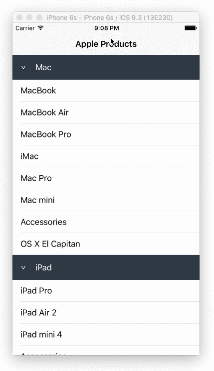

# ios-swift-collapsible-table-section
A simple iOS swift project demonstrates how to implement collapsible table section.

### Demo ###
<br />

### How to implement collapsible table sections? ###

#### Step 1. Prepare the Data ####

Let's say we have the following data that is grouped to different sections, each section is a `Section` object:

```swift
struct Section {
  var name: String!
  var items: [String]!
  var collapsed: Bool!
    
  init(name: String, items: [String]) {
    self.name = name
    self.items = items
    self.collapsed = false
  }
}
    
var sections = [Section]()

sections = [
  Section(name: "Mac", items: ["MacBook", "MacBook Air", "MacBook Pro", "iMac", "Mac Pro", "Mac mini", "Accessories", "OS X El Capitan"]),
  Section(name: "iPad", items: ["iPad Pro", "iPad Air 2", "iPad mini 4", "Accessories"]),
  Section(name: "iPhone", items: ["iPhone 6s", "iPhone 6", "iPhone SE", "Accessories"])
]
```
`collapsed` indicates whether the current section is collapsed or not, by default is `false`.

#### Step 2. Design the Header and Cell ####

Select the `Table View` in the story board, choose `Dynamic Prototypes` and set `Prototype Cells` to `2`, one for the custom header and one for the row cell, and assign the `Identifier` to `header` and `cell` respectively.

Add a UIButton (the toggler) and a Label to the header prototype cell, create a swift file which extends `UITableViewCell` and name it `CollapsibleTableViewHeader.swift`. The file is super simple, it defines two IBOutlets for the toggle button and label. Finally set the header cell class to our custom header `CollapsibleTableViewHeader` and link the IBOutlets.

Now the file should look like this:

```swift
import UIKit

class CollapsibleTableViewHeader: UITableViewCell {
    
  @IBOutlet var titleLabel: UILabel!
  @IBOutlet var toggleButton: UIButton!
    
}
```

By creating a prototype cell and subclassing UITableViewCell, we have the following benefits:
* We can visually design the custom header
* We shouldn't need to create a nib and register it to the the tableView like the following, personally I don't like having a nib in my project and if we use `dequeueReusableHeaderFooterViewWithIdentifier`, seems like we can't have 0 rows in that section dynamically:
```swift
let nib = UINib(nibName: "TableSectionHeader", bundle: nil)
tableView.registerNib(nib, forHeaderFooterViewReuseIdentifier: "TableSectionHeader")
```

#### Step 3. The UITableViewDelegate  ####

First the number of sections is `sections.count`:

```swift
override func numberOfSectionsInTableView(tableView: UITableView) -> Int {
  return sections.count
}
```

For the number of rows in each section, we use `collapsed` property to control it, if `collapsed` is true, then return 0, otherwise return items count:

```swift
override func tableView(tableView: UITableView, numberOfRowsInSection section: Int) -> Int {
  return (sections[section].collapsed!) ? 0 : sections[section].items.count
}
```

We use tableView's viewForHeaderInSection function to hook up our custom header:

```swift
override func tableView(tableView: UITableView, viewForHeaderInSection section: Int) -> UIView? {
  let header = tableView.dequeueReusableCellWithIdentifier("header") as! CollapsibleTableViewHeader
        
  header.titleLabel.text = sections[section].name
  header.toggleButton.tag = section
  header.toggleButton.addTarget(self, action: #selector(CollapsibleTableViewController.toggleCollapse), forControlEvents: .TouchUpInside)
        
  header.toggleButton.rotate(sections[section].collapsed! ? 0.0 : CGFloat(M_PI_2))
        
  return header.contentView
}
```

noticed that we register the touch up inside event for the toggler, once it's tapped, it will trigger the `toggleCollapse` function.

Last, the normal row cell is pretty straightforward:

```swift
override func tableView(tableView: UITableView, cellForRowAtIndexPath indexPath: NSIndexPath) -> UITableViewCell {
  let cell = tableView.dequeueReusableCellWithIdentifier("cell") as UITableViewCell!
    
  cell.textLabel?.text = sections[indexPath.section].items[indexPath.row]
    
  return cell
}
```

And here is the toggle function:

```swift
func toggleCollapse(sender: UIButton) {
  let section = sender.tag
  let collapsed = sections[section].collapsed
    
  // Toggle collapse
  sections[section].collapsed = !collapsed
    
  // Reload section
  tableView.reloadSections(NSIndexSet(index: section), withRowAnimation: .Automatic)
}
```

That's it, please refer to the source code and see the detailed implementation.
